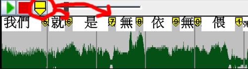

# Open Karaoke Toolkit

### Screenshot


Open Karaoke Toolkit (OKT) is an open source software for whoever want to make karaoke animations. It has a GUI  
interface that general users should feel it easy to use.

But OKT is still in a ***very early development stage***, it lacks most of the needed features and is not stable, so 
normal users wouldn't want to use it for now.

# Animations

When it comes to karaoke, the most important thing is the sliding animation. A sliding animation could help singers know  
which word they should have sung now. OKT provides video makers to put marks that indicate the period when a word should
be sang.



# Features
- Customizable display style.
- Save/Load system.
- Support English and Chinese lyrics systems.
- (TODO) Support phonetic notations.

## Chinese (Eastern Languages)
I want to introduce a special feature called _***Linked Words***_. It is useful especially for the Taiwanese language.
In Taiwanese, they are many words that are pronounced as the linked sound of 2 words. For example,  the words "我們" or 
"我等". To hint singers that the word should be pronounced in link, I referenced a Japanese system called ***Yoon***. If
2 words should be pronounced as link sound, the 2nd word would be smaller, like the "きゃ", which should be originally 
pronounced as "ki ya", but in Yoon, it's "kya". There's a set of special "smaller" characters in Japanese charset
, however, there's no for Chinese.

If you want to type a linked word in OKT, just add an apostrophe(') before the word you want smaller, e.g. "我'們" &   
"我'等", and you'll see it scale in the display.

## English(Western Languages)
Western languages come with a different word separation system. Unlike Chinese, a word is separated based on spaces.
OKT is designed to handle both language systems. A tricky thing is that, an English word may consist of multiple 
syllables, which makes it so not straight-forward to put marks in OKT while listening to the music. So, I came up with
a solution, which enables users to break a multi-syllables word into parts using the symbol **"_"** or **underscores**.
Now, users can place marks in syllables. Of course, you don't have to use this trick, anyway, I find it much easier to
place marks with it.

# Supported Platforms

Since this project is written in ***Java***, it should be able to run on Windows, Linux, and macOS.

| Platform | Can run            | Tested Environment |  
|----------|--------------------|--------------------|  
| Window   | :heavy_check_mark: | JDK18              |  
| Linux    | :heavy_check_mark: | :x:                |  
| macOS    | :heavy_check_mark: | :x:                |  

# How to Build & Run?

This project uses Gradle Build Tool. You can easily run the command below to build and run:

### For Windows:

```  
.\gradlew.bat run  
```  

### For Linux / macOS:

```  
./gradlew run  
```  

Or, like me, you could use the IntelliJ Idea IDE to build and run.

# Report a Bug / Make a Suggestion

You can post an issue to the [issue page](https://github.com/Bowen951209/open-karaoke-toolkit/issues).

# Background Story

I like to find some karaoke videos on YouTube and sing it, but some of the musics that I'd like to listen to are not so  
well known which makes it hard to find a karaoke version on the Internet. Hence, I decided to make my own video. After a  
lot of research, I found a software called [Sayatoo](https://www.geemio.com/), but I quickly find that it requires you  
to purchase the software in order to unlock the full features. I don't want to buy it, using the trial version with some  
clips editing and I published [my first karaoke video](https://youtu.be/XKbiAlB-TvI?si=FIgABXUIMRC72PDI) on to YouTube.  
It was great, until the 2nd and 3rd video, it was so tired to do some editing tricks to bypass the trial restrictions.  
That was when I decided to make an open source karaoke software, it'll be pretty much like Sayatoo, but it's  
***open source***. If you need a professional karaoke software, I also encourage you to  
[buy Sayatoo](https://www.sayasub.com/purchase/?mid=&ver=). But I believe, with the community and my effort, OKT will  
finally become a good-enough karaoke software!

# Some Notes

Most of the essential parts are not fully implemented yet, but the outline of the software has a bit come out. I hope  
the program can be kept working on for a while, at least it should have the full functions for making a karaoke video.

The thing is, I am a hobbyist. The code may not be too beautiful or harmony, but I look for improvement, so welcome to
give suggestions and instructions!

# Acknowledgement

Thanks to Sayatoo company for providing the design idea.