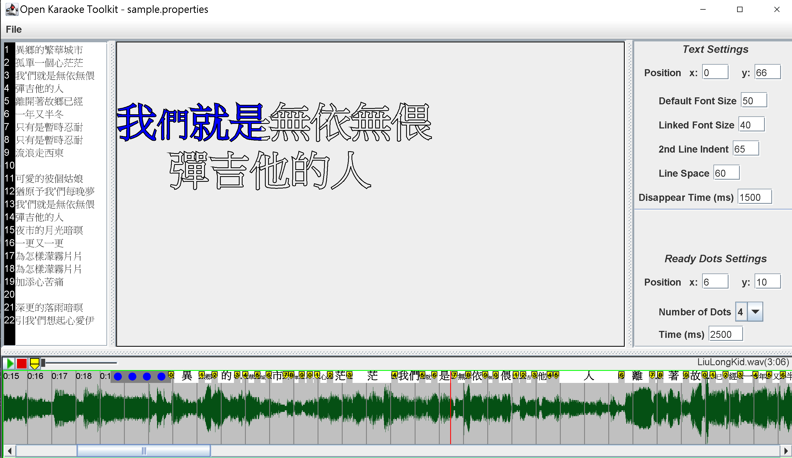
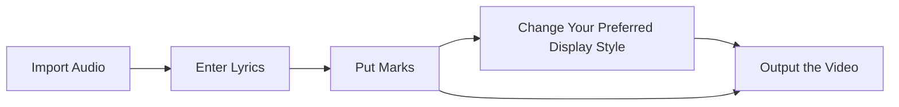

# Open Karaoke Toolkit

### Screenshot



Open Karaoke Toolkit (OKT) is an open source software for whoever want to make karaoke animations. It has a GUI
interface that general users should feel it easy to use.

But the OKT is still in a ***very early development stage***, it doesn't even have most of the needed features, so normal
users wouldn't want to use it for now.

# Animations

When it comes to karaoke, the most important thing is the sliding animation. A sliding animation could help singers know
which word they should have sung now. OKT provides video makers to put marks that indicate the period when a
word should be sang.


# How to make a video in OKT?

The steps would be like this:



# Features
 - Customizable display style.
 - Save/Load system.
 - (TODO) Support English and Chinese lyrics systems.
 - (TODO) Support phonetic notations.


## A Special Feature

(This may be useless for English users.)

Apart from the common features, I want to introduce a special one called _***Linked Words***_. It is useful especially 
for the Taiwanese language. In Taiwanese, they are many words that's pronounced as the linked sound of 2 words. For example, 
the "we" word is commonly miss-written as "阮", which match the sound in Taiwanese but with ***wrong*** Chinese character.
For the correct character, it would be better to write it as "我們" or "我等", but we have to tell singers that the 2
words should be pronounced as the linked sound. To do this, I referenced a Japanese system called ***Yoon*** that if 2 
words should be pronounced as linked sound, the 2nd word would be smaller, like the "きゃ", it should be originally pronounced
as "ki ya", but for the Yoon case, it's "kya". There's a set of the special "smaller" characters in Japanese IME, however,
there's no for Chinese.

If you want to type a linked word in OKT, just add an apostrophe(') before the word you want it smaller, e.g. "我'們" & 
"我'等", and you'll see it scale in the display. 

# Supported Platforms

Since this project is coded with ***Java***, it should be able to run on Windows, Linux, and macOS.

| Platform | Can run            | Tested             |
|----------|--------------------|--------------------|
| Window   | :heavy_check_mark: | :heavy_check_mark: |
| Linux    | :heavy_check_mark: | :x:                |
| macOS    | :heavy_check_mark: | :x:                |

# How to Build & Run?

This project uses the Gradle Build Tool. You can easily run the command below to build and run:

### For Windows:

```
.\gradlew.bat run
```

### For Linux / macOS:

```
./gradlew run
```

Or, like me, you could use the IntelliJ Idea IDE to build and run.

# Report a Bug / Make a Suggestion

You can post an issue to the [issue page](https://github.com/Bowen951209/open-karaoke-toolkit/issues).

# Background Story

I like to find some karaoke videos on YouTube and sing it, but some of the musics that I'd like to listen to are not so
well known which makes it hard to find a karaoke version on the Internet. Hence, I decided to make my own video. After a
lot of research, I found a software called [Sayatoo](https://www.geemio.com/), but I quickly find that it requires you
to purchase the software in order to unlock the full features. I don't want to buy it, using the trial version with some
clips editing and I published [my first karaoke video](https://youtu.be/XKbiAlB-TvI?si=FIgABXUIMRC72PDI) on to YouTube.
It was great, until the 2nd and 3rd video, it was so tired to do some editing tricks to bypass the trial restrictions.
That was when I decided to make an open source karaoke software, it'll be pretty much like Sayatoo, but it's
***open source***. If you need a professional karaoke software, I also encourage you to
[buy Sayatoo](https://www.sayasub.com/purchase/?mid=&ver=). But I believe, with the community and my effort, OKT will
finally become a good-enough karaoke software!

# Some Notes

Most of the essential parts are not fully implemented yet, but the outline of the software has a bit come out. I hope
the program can be kept working on for a while, at least it should have the full functions for making a karaoke video.

I want to add that, since I am a Taiwanese, you can probably find many mistakes in my English. And I am still a senior
high school student, there should be many issues with my code style and design. If anyone wants to point out a problem,
I am willing to learn and improve.

# Acknowledgement

Thanks to Sayatoo company for providing the design idea.